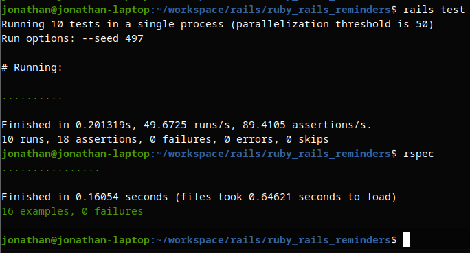

## Ruby Rails Reminders

A reminders API built using Ruby 3, Rails 7 and PostgreSQL

The API provides access to users and tickets and sends a reminder email to an assigned user about a tickets upcoming due date

### Requirements

Docker and Docker Compose

### How to run

To start the containers run: `docker compse up`

### Set up database

To run the migrations and seeds run: `bin/docker-initdb.sh`

### Verify in browser

You should now be able to visit [http://localhost:3000/tickets](http://localhost:3000/tickets) and see something like this:


And at [http://localhost:3000/users](http://localhost:3000/users) see something like this:


## Using the API

To CRUD users and tickets follow the standard restful approach using a tool such as Postman

For example, to create a user HTTP `POST` to `/users` with the following JSON body:

```
{
  "name": "Jane Smith",
  "email": "jane@mail.com",
  "send_due_date_reminder": true,
  "due_date_reminder_day_offset": 1,
  "due_date_reminder_time": "09:00:00",
  "due_date_reminder_interval": 1,
  "time_zone": "Europe/Vienna",
  "configured_reminder_types": [
      "email"
  ]
}
```

Afterwards if you HTTP `GET` from `/users` you should see something like:


You can also: 

Update a user by using a HTTP `PATCH` with a JSON user object to `/users/1`where `1` is the id of the user

Delete a user by using a HTTP `DELETE` to `/users/1` where `1` is the id of the user

Get a single user by using a HTTP `GET` to `/users/1` where `1` is the id of the user

The same pattern applies to tickets

Here is an example of creating a ticket by using a HTTP `POST` to `/tickets` with a ticket JSON object:

```
{
  "title": "test ticket 2",
  "description": "my ticket 2",
  "assigned_user_id": 1,
  "due_date": "2024-02-03",
  "ticket_status_id": 3
}
```

Afterwards if you HTTP `GET` from `/tickets` you should see something like:


## Scheduled reminders

The Whenever gem is used to schedule a daily task that runs at 00:00:00 everyday (`config/schedule.rb`)

The task runs `Reminders::Manager.send_reminders` to send the reminders to the users

I did not manage to get Whenever and DelayedJob running in the docker compose setup therefore to test this

You would need to install the application using a version manager like RVM and run the code manually via the rails console:

```
rvm install 3.3.0
rvm use ruby-3.3.0@ruby-rails-reminders
bundle install
```

Then configure a postgres role to match the defaults in `database.yml` and initialize the database:

```
rails db:prepare
```

The seeded database has 1 user with 1 ticket which is set up to be a reminder

To run this in the console you must first bypass the DelayedJob at line 4 of `Reminders::Email`

And change it to use `deliver_now` on the mailer instead

Then when running the reminders code in the console: `Reminders::Manager.send_reminders` 

You will see the email output

(It's a very hacky way to live test this but I unfortunately didn't have the time to set it up correctly in docker compose)

## Tests

I also did not manage to get the tests running in the docker compose setup

If you wish to run them install the application like previously mentioned

Then run the tests:

```
rails test
rspec
```

The output would look something like:



