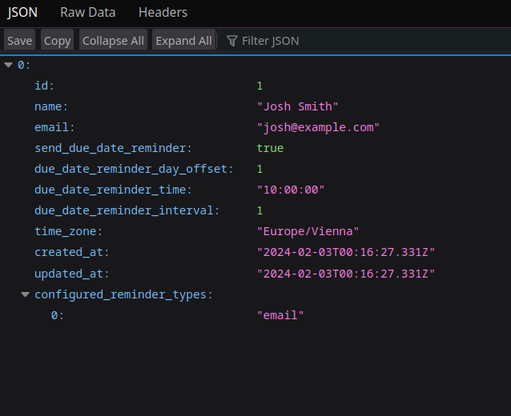
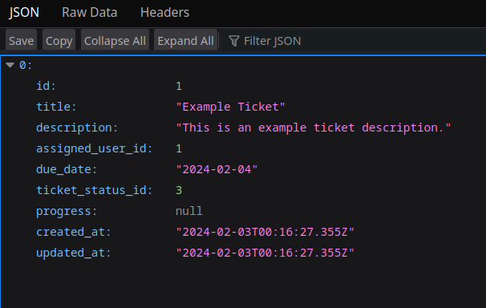
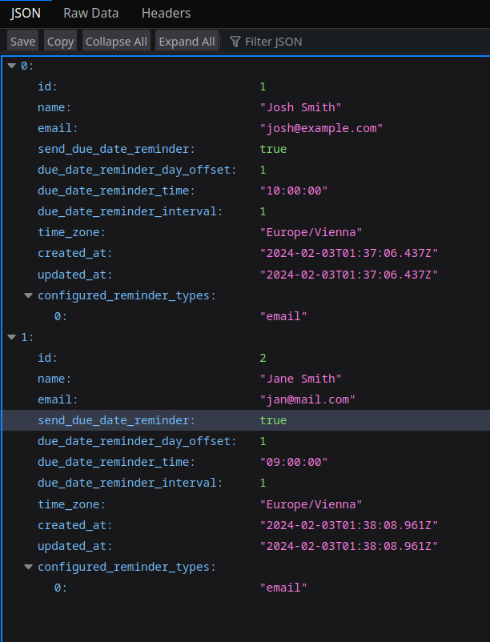
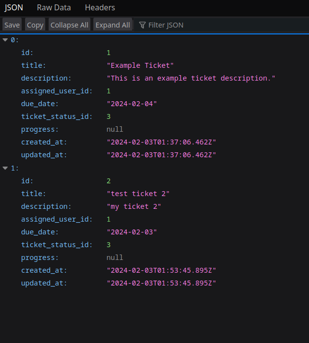

## Ruby Rails Reminders

A reminders API built using Ruby 3, Rails 7 and PostgreSQL

The API provides access to users and tickets and sends a reminder email to an assigned user about a tickets upcoming due date

To read about how the scheduled reminders are implements go to: [Scheduled reminders](#scheduled-reminders)

### Requirements

RVM

Docker 

Docker Compose

### How to run

Clone and cd into the repository then:

Start the database: `docker compose up -d`

Install Ruby: `rvm install 3.3.0`

Create the gemset: `rvm use ruby-3.3.0@ruby-rails-reminders --create`

Install the dependecies: `bundle install`

Initialize the database: `rails db:prepare`

Update the crontab: `whenever --update-crontab`

Start the Delayed Job server (maybe in another terminal window/tab): `rake jobs:work`

Run the rails server: `rails s`

Confirm installation by visiting: [http://localhost:3000/users](http://localhost:3000/users)

You should see something like:



You can also visit: [http://localhost:3000/tickets](http://localhost:3000/tickets)

You should see something like:



## Run the tests

To run the tests run: `rails test` and `rspec`

They should all pass

## Using the API

To CRUD users and tickets follow the standard restful approach using a tool such as Postman

For example, to create a user HTTP `POST` to `/users` with the following JSON body:

```
{
  "name": "Jane Smith",
  "email": "jane@mail.com",
  "send_due_date_reminder": true,
  "due_date_reminder_day_offset": 1,
  "due_date_reminder_time": "09:00:00",
  "due_date_reminder_interval": 1,
  "time_zone": "Europe/Vienna",
  "configured_reminder_types": [
      "email"
  ]
}
```

Afterwards if you HTTP `GET` from `/users` you should see something like:



You can also: 

Update a user by using a HTTP `PATCH` with a JSON user object to `/users/1`where `1` is the id of the user

Delete a user by using a HTTP `DELETE` to `/users/1` where `1` is the id of the user

Get a single user by using a HTTP `GET` to `/users/1` where `1` is the id of the user

The same pattern applies to tickets

Here is an example of creating a ticket by using a HTTP `POST` to `/tickets` with a ticket JSON object:

```
{
  "title": "test ticket 2",
  "description": "my ticket 2",
  "assigned_user_id": 1,
  "due_date": "2024-02-03",
  "ticket_status_id": 3
}
```

Afterwards if you HTTP `GET` from `/tickets` you should see something like:




## Scheduled reminders

The scheduled reminders work like this:

The Whenever gem sets up the crontab with a daily job the runs the reminders scheduler at 00:00:00

The `Reminders::Manager` queries for users who have reminders ready to be scheduled using the `User` model scope:

`User.with_active_reminder_tickets`

This scope will query for users and thier active remindable (a reminder can be sent for them) tickets

A user and ticket will be returned if the user has activated their reminders, the ticket is in the active state, 

the due date has not passed and the current date of the query is n number of days before the ticket due date

(where n is the user defined due date reminder offset)

When the users/tickets are returned a reminder will be scheduled at their defined reminder time in daily intervals (user defined) until the due date

Example:

The user is defined like this:

```
{
  "id": 1,
  "name": "Josh Smith",
  "email": "josh@mail.com",
  "send_due_date_reminder": true,
  "due_date_reminder_day_offset": 2,
  "due_date_reminder_time": "09:00:00",
  "due_date_reminder_interval": 1,
  "time_zone": "Europe/Vienna",
  "configured_reminder_types": [
      "email"
  ]
}
```

A user has the following ticket:

```
{
    "id": 1,
    "title": "Example Ticket",
    "description": "This is an example ticket description.",
    "assigned_user_id": 1,
    "due_date": "2024-02-04",
    "ticket_status_id": 3,
}
```

The current date is `2024-02-02` or 2 days before the ticket's due date

Because the user's `due_date_reminder_day_offset` is set to 2 days before due date the user should have reminders scheduled 

The reminders will be scheduled for every day until the due date as an interval of 1 means every day (2 would mean every second day)

The cron task will run at `2024-02-01 00:00:00` and then:

`Reminders::Manager.send_reminders` is called

The `User.with_active_reminder_tickets` scope is used to return the above user with his remindable ticket eager loaded

The reminders are scheduled for each ticket for each `configured_reminder_types` (currently just `email` is available)

The reminders are scheduled using `DelayedJob` and are send at the users `due_date_reminder_time`

### Testing

Besides the rpec tests, in order to test locally and not have to wait for the scheduler to run you can test on the rails console

I have added an environment check that sends the reminder mails instantly with `deliver_now` in development

The database is already seeded with a user who has an active remindable ticket which can be scheduled today

```
rails c
> Reminders::Manager.send_reminders
```

The reminders scheduler should run and you should see two (one for each day until due date) of the following emails in the console output:

```
UsersMailer#reminder_mail: processed outbound mail in 3.8ms
Delivered mail 65bdf8bc46618_95b8c1c-32b@jonathan-laptop.mail (3.8ms)
Date: Sat, 03 Feb 2024 09:26:36 +0100
From: from@example.com
To: josh@example.com
Message-ID: <65bdf8bc46618_95b8c1c-32b@jonathan-laptop.mail>
Subject: Reminder: Due date for "Example Ticket" is upcoming
Mime-Version: 1.0
Content-Type: text/html;
 charset=UTF-8
Content-Transfer-Encoding: 7bit

<!DOCTYPE html>
<html>
  <head>
    <meta http-equiv="Content-Type" content="text/html; charset=utf-8">
    <style>
      /* Email styles need to be inline */
    </style>
  </head>

  <body>
    <h1>Reminder: Due date for "Example Ticket" upcoming</h1>
<h2>Due on: 2024-02-04</h2>
<p>It's not going to finish itself!</p>
  </body>
</html>

```

View the tests at `./spec/lib/reminders/manager.rb` for more complex data setups
